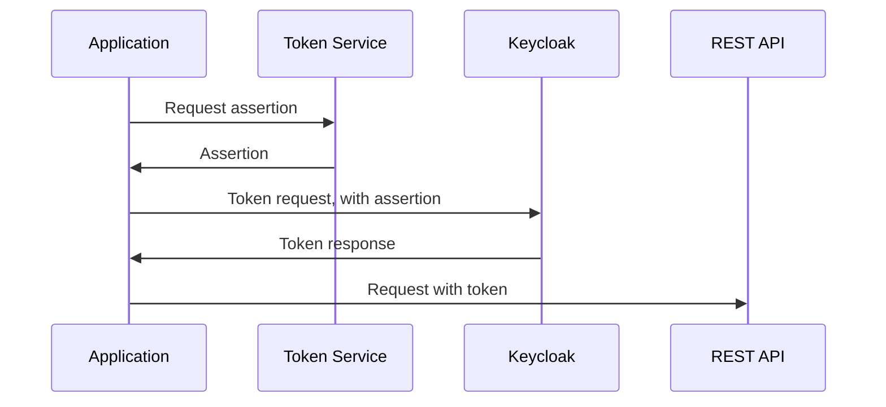
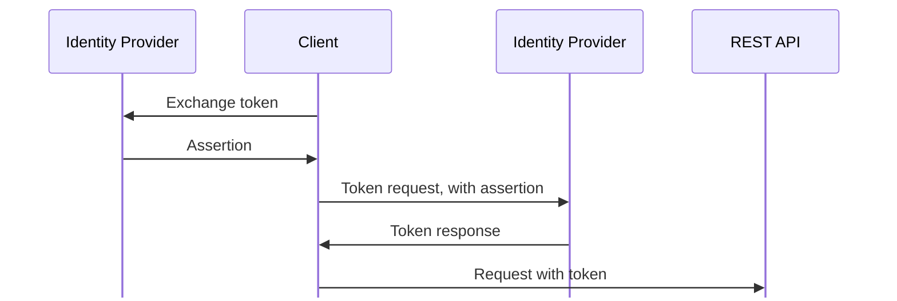

## Assertion Framework for OAuth 2.0 Client Authentication and Authorization Grants

```mermaid
sequenceDiagram
    participant C as Application
    participant TS as Token Service
    participant KC as Keycloak
    participant RS as REST API
    C->>TS: Request assertion
    TS->>C: Assertion
    C->>KC: Token request, with assertion
    KC->>C: Token response
    C->>RS: Request with token
```

## OAuth Identity and Authorization Chaining Across Domains

```mermaid
---
config:
    mirrorActors: false
    actorFontSize: 10
    messageFontSize: 10
---
sequenceDiagram
    participant IDPA as Identity Provider #A
    participant C as Client
    participant IDPB as Identity Provider #B
    participant RS as REST API
    C->>IDPA: Exchange token
    IDPA->>C: Assertion
    C->>IDPB: Token request, with assertion
    IDPB->>C: Token response
    C->>RS: Request with token
```
