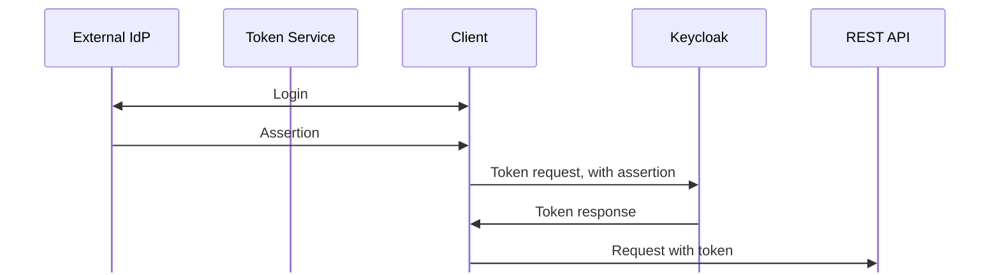
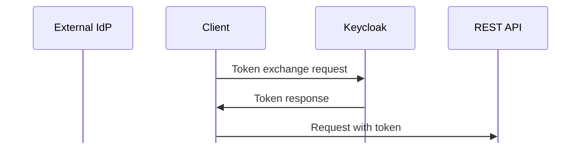

## Assertion Framework for OAuth 2.0 Client Authentication and Authorization Grants

### Client action on behalf of user

### Client action on behalf of itself

## OAuth Identity and Authorization Chaining Across Domains

### With additional Token Service

## Keycloak External to Internal Token Exchange

