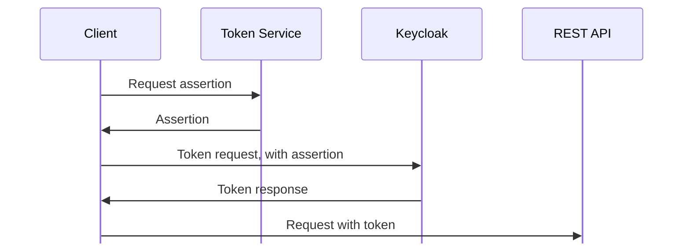
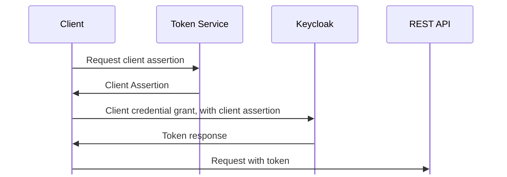
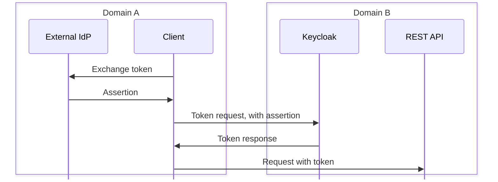
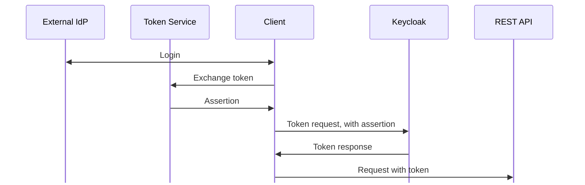
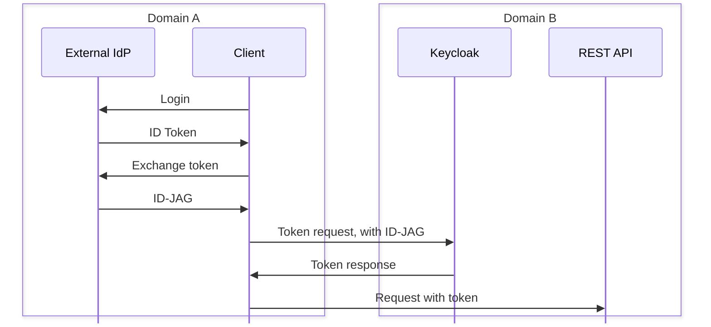
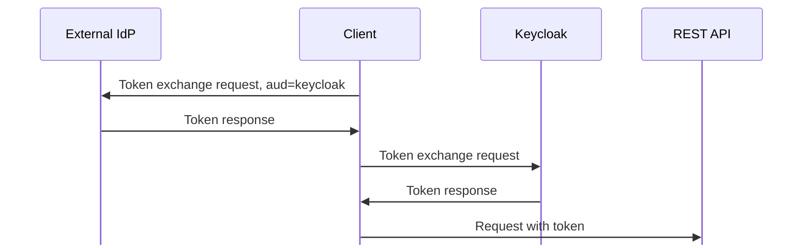

## Assertion Framework for OAuth 2.0 Client Authentication and Authorization Grants

## OAuth Identity and Authorization Chaining Across Domains

If the External IdP does not support token exchange, this can be delegated to a separate Token Service.

### With additional Token Service

## Identity Assertion Authorization Grant

## Keycloak External to Internal Token Exchange

The problem with this pattern is the token exchange request has to include an subject_token with `aud=keycloak`, which it will not have:

* If client is in a chain of requests the token will have the client as the audience, not Keycloak. To obtain a token with audience including Keycloak it would have to make a separate request to the External IdP, which is what identity chaining does
* If the client is a frontend application it will be accessing both internal and external services; If it only had to access external services there is no need for a local IdP and the user can just login directly to Keycloak
