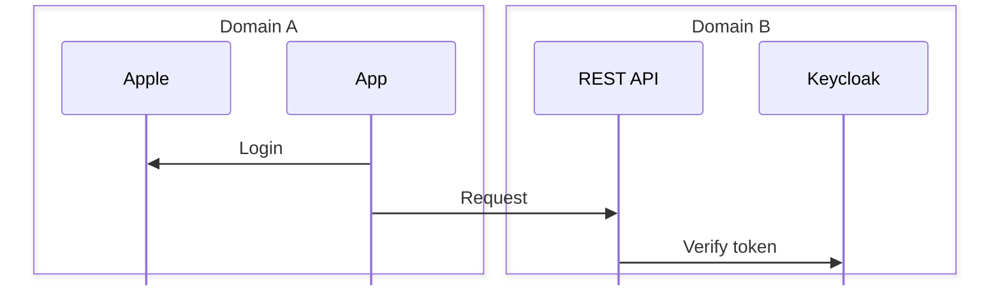
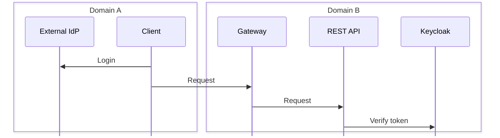
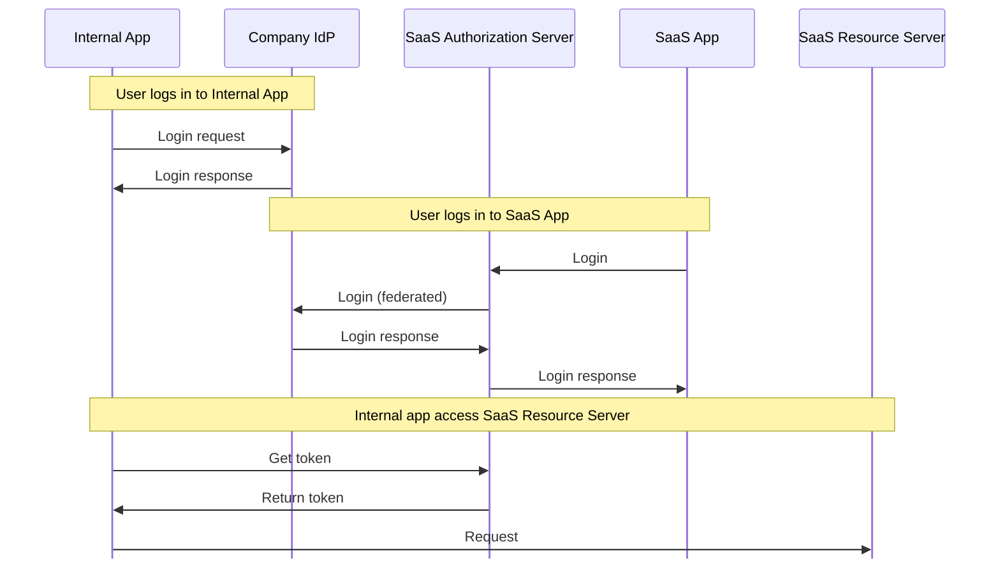

# Use-Cases

## Mobile Sign in with AppleID

Mobile app uses sign in with AppleID and wants to access REST APIs, without requiring a separate login.

## Gateway

External applications uses a different IdP to internal REST APIs.

## SaaS login through Company IdP

A SaaS application is utilised by a company that wants to allow users to authenticate via their own IdP, but also allow internal applications to use REST APIs provided by the SaaS provider without additional logins.

