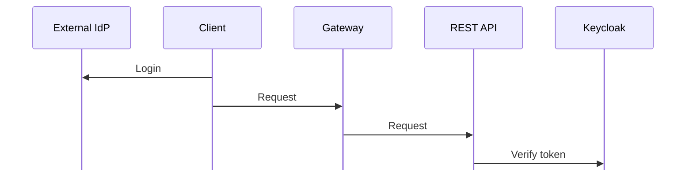

# Use-Cases

## Mobile Sign in with AppleID

```mermaid
---
config:
    mirrorActors: false
---
sequenceDiagram
    box Apple
    participant Apple as Apple
    participant App as App
    end
    box KC
    participant RS as REST API
    participant KC as Keycloak
    end
    App->>Apple: Login
    App->>RS: Request
    RS->>KC: Verify token
```

## Gateway

```mermaid
---
config:
    mirrorActors: false
---
sequenceDiagram
    participant IA as External IdP
    participant C as Client
    participant G as Gateway
    participant RS as REST API
    participant KC as Keycloak
    C->>IA: Login
    C->>G: Request
    G->>RS: Request
    RS->>KC: Verify token
```
