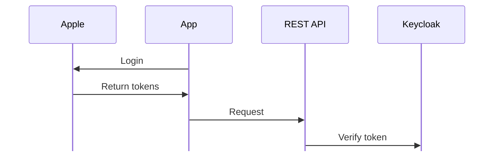

# Use-Cases

## Mobile logs in with AppleID

```mermaid
---
config:
    mirrorActors: false
---
sequenceDiagram
    participant Apple as Apple
    participant App as App
    participant RS as REST API
    participant KC as Keycloak
    App->>Apple: Login
    Apple->>App: Return tokens
    App->>RS: Request
    RS->>KC: Verify token
```
